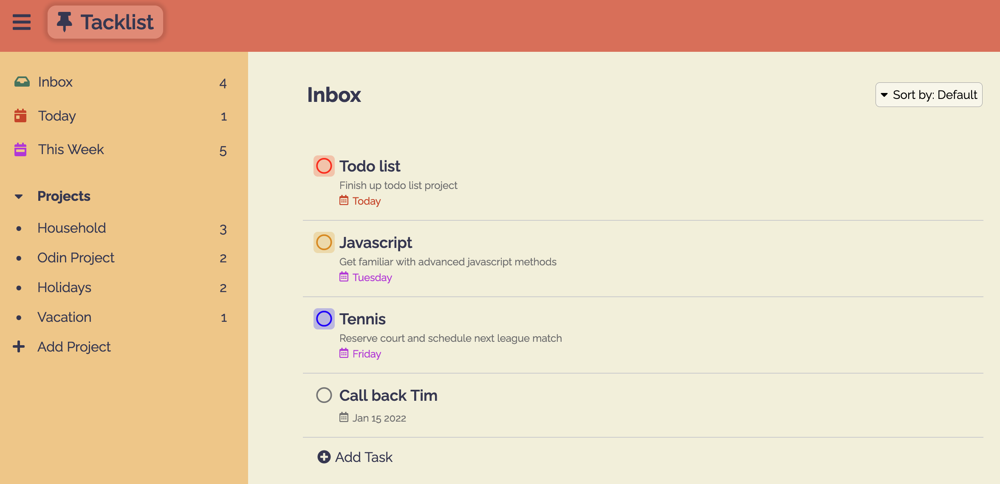

# Todo-List

To-do list application encompassing JS OOP common principles / best practices. 
Layout and design inspired by Todoist (todoist.com)

--> <a href="https://sumedh-inamdar.github.io/Todo-List/">link to page</a> <--

JS modules and responsibilities listed below

createDOM (service provider)
- Create elements and add to document
- Can also create elements and return them to other modules
- Calls updateDOM to load active projects / tasks

updateDOM (service provider)
- Handles updating DOM elements
- Updates DOM with current active projects / tasks
- addProjectDOM

setupEventListeners (service provider)
- Query elements and setup event listeners
- Calls appLogic functions 

appLogic (controller / coordinator)
- Responsible for logic of running application
    - Add / remove projects and tasks
    - Editing of projects and tasks
    - Calls storage and updateDOM modules 

Storage (information holder)
- Maintains state of application

## New lessons / material incorporated
- SOLID principles
- Modular patterns

## Pending tasks

- [x] Task edit / delete buttons
- [x] Project links (event listeners)
- [x] Completed task function
- [x] Format dates in DOM
- [x] Today / This week
- [x] View / modify project of a single task
- [x] Add dropdown for task priority selection
- [x] Set task circle color based on priority
- [x] Sort tasks based on priority / due date
- [x] Add dropdown for sorting
- [x] Setup local storage
- [x] keyboard listener for adding task / project (enter, escape key)
- [x] Add CSS / styling (beautify)
- [x] Show / hide nav bar
- [x] Add hover effect to project li element (shows edit and delete button)
- [x] Add title attribute to project divs
- [x] Add footer

## Future features
- [ ] add keyboard listener (up / down) to dropdown menus
- [ ] Option to hide completed tasks
- [ ] Drag and drop tasks

## Bugs to fix
- [ ] expand/collapse transitions
- [ ] shifting of buttons during hover (e.g. sort by, cancel task)
